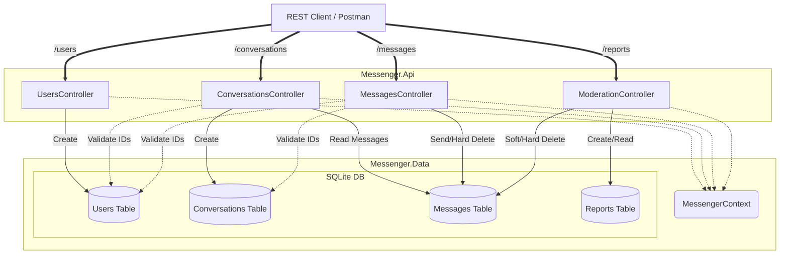
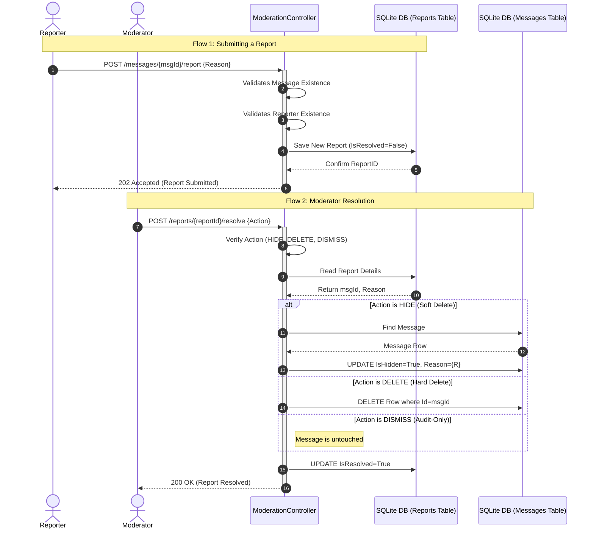
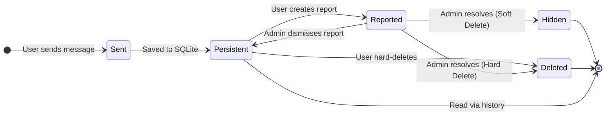

# Messenger API Prototype

A RESTful Web API built with **C#** and **ASP.NET Core**, serving as the backend for a minimal messenger application. This project was built to satisfy the core messaging architecture requirements, along with **Variant 10: Message Moderation and Reporting**.

## 🚀 Features

* **Relational Architecture:** Strict referential integrity between Users, Conversations, and Messages.
* **Offline Support:** A pull-based HTTP architecture allowing offline users to retrieve missed messages upon connection.
* **Advanced Moderation (Variant 10):**
    * Report generation for specific messages.
    * Resolution handling via **Soft Deletion** (maintains an audit trail by flagging `IsHidden`) or **Hard Deletion** ("nuclear" row removal).
* **Automated Database Generation:** Utilizes Entity Framework Core to automatically generate the SQLite database and schema on startup.
* **Integration Testing:** Fully automated xUnit testing pipeline utilizing an in-memory test server (`WebApplicationFactory`).

## 🛠️ Tech Stack

* **Language:** C# 11 / .NET 7 (or 8)
* **Framework:** ASP.NET Core Web API
* **Database:** SQLite (Embedded)
* **ORM:** Entity Framework (EF) Core
* **Testing:** xUnit + `Microsoft.AspNetCore.Mvc.Testing`

## ⚙️ How to Run

Because the application uses an embedded SQLite database and includes an auto-generation script, setup is zero-configuration.

1. Clone the repository.
2. Open a terminal in the `Messenger.Api` folder.
3. Run the application:
   ```bash
   dotnet run
4. Navigate to `http://localhost:<port>/swagger` in your browser to interact with the API visually.

## 📡 API Endpoints

### Users & Conversations
| Method | Endpoint | Description |
| :--- | :--- | :--- |
| `POST` | `/users` | Create a new user. Returns a UUID. |
| `POST` | `/conversations` | Initialize a new conversation (direct or group). |
| `GET` | `/conversations/{id}/messages` | Retrieve the chat history (ignores soft-deleted messages). |

### Messaging
| Method | Endpoint | Description |
| :--- | :--- | :--- |
| `POST` | `/messages` | Send a message to an existing conversation. |
| `DELETE` | `/messages/{id}` | Permanently remove a message (User Action). |

### Moderation (Variant 10)
| Method | Endpoint | Description |
| :--- | :--- | :--- |
| `POST` | `/messages/{id}/report` | Submit a report for a specific message. |
| `POST` | `/reports/{id}/resolve` | Resolve a report with actions: `HIDE`, `DELETE`, or `DISMISS`. |
<<<<<<< HEAD
=======
   dotnet run
>>>>>>> 332da36 (docs: add README)
=======

## 🏗 System Architecture

### Component Diagram



### Sequence diagram of Moderation Workflow



### State Diagram of a Message Life Cycle


>>>>>>> ec65a6f (Revise README with new system architecture diagrams)
